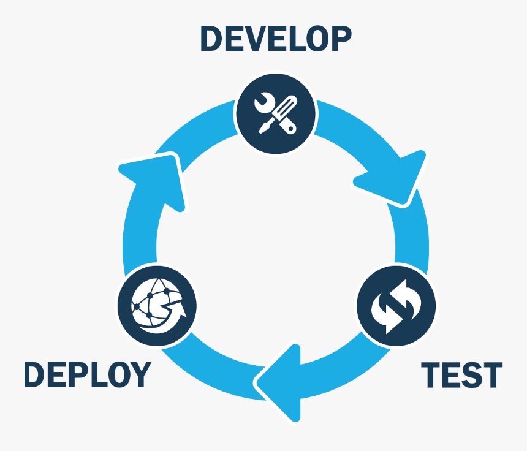
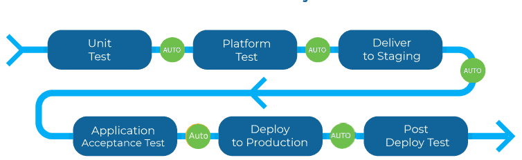
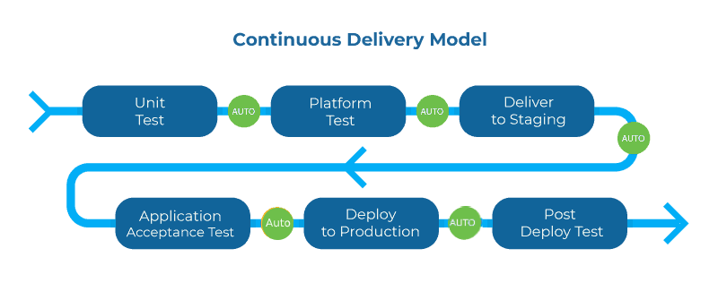
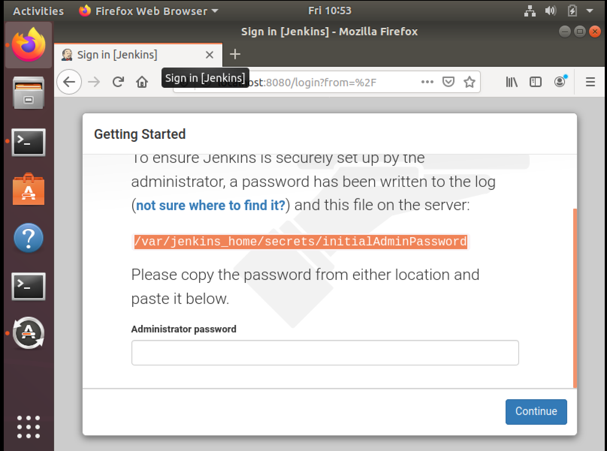
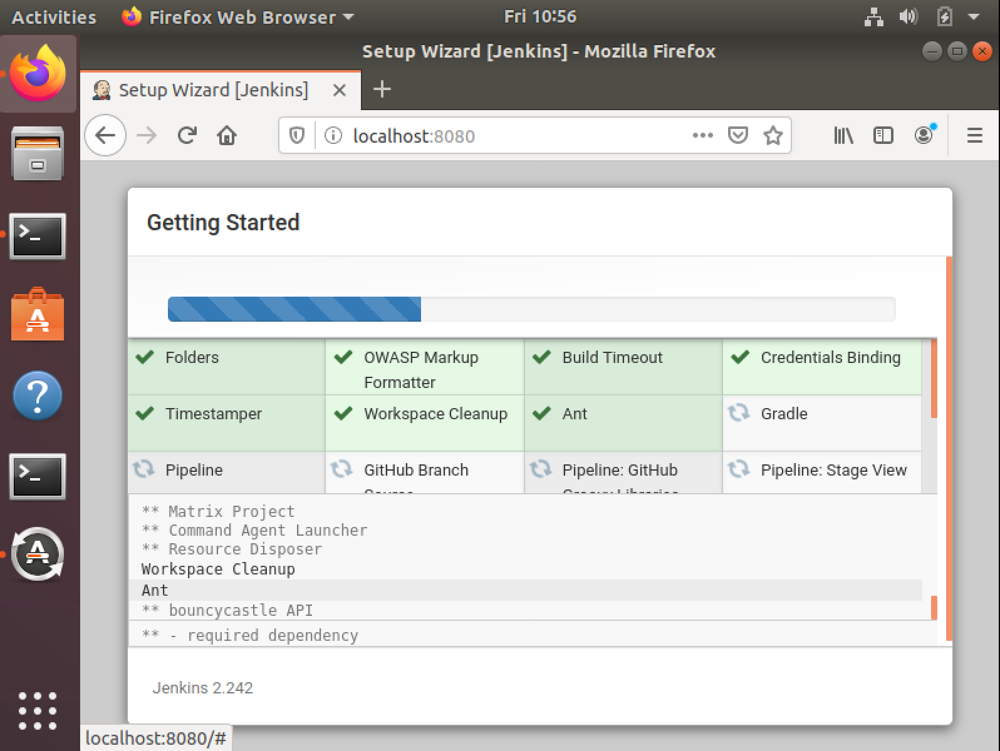
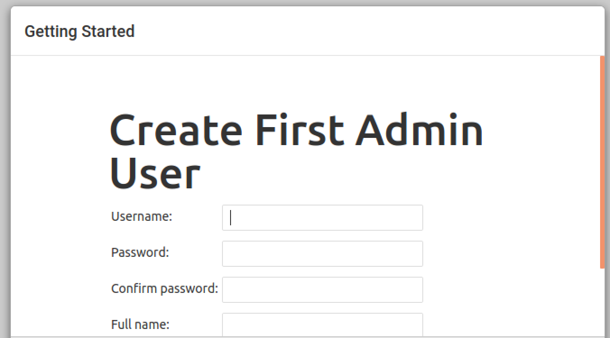
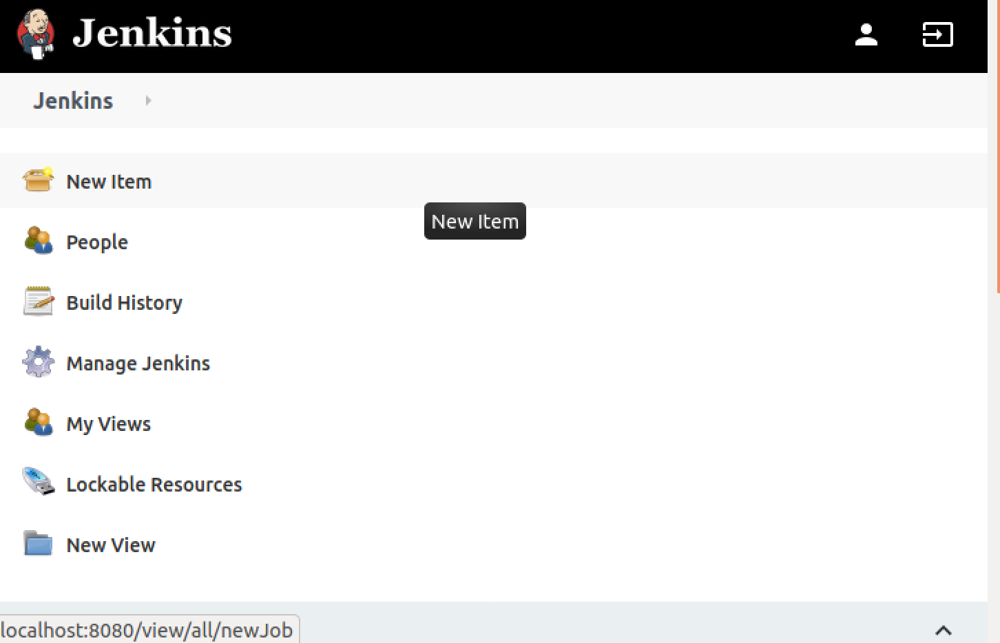

# CI/CD and Jenkins

Welcome to the most interesting part of DevOps. One of the reason DevOps is a success - Continious Integration and Continiour Delivery. This also implements and promotes Agile Development.

## Continious Integration



Continious integration is a development pracitce where developers integrate their code to a shared repository frequently(Version Contolled system) several times a day. Each integration is automatically built, tested and verified as soon as the code is saved to these Version Contorl system.

Key benifit of integrating regularly is to detect any defects/errors at early stage of the development process and before the code is released to the customers. Since, each change is a small piece of functionality, a defect caused when you commit you change can be easily reverted. 

> Continuous Integration doesn’t get rid of bugs, but it does make them dramatically easier to find and remove

**Benifits**:
* Say goodbye to long and tense integrations
* Increase visibility enabling greater communication
* Catch issues early and nip them in the bud
* Spend less time debugging and more time adding features
* Build a solid foundation
* Stop waiting to find out if your code’s going to work
* Reduce integration problems allowing you to deliver software more rapidly

**Practice**:
* The practices
* Maintain a single source repository
* Automate the build
* Make your build self-testing
* Every commit should build on an integration machine
* Keep the build fast
* Test in a clone of the production environment
* Make it easy for anyone to get the latest executable version
* Everyone can see what’s happening
* Automate deployment

**How its done**:
* Developers check out code into their private workspaces
* When done, commit the changes to the repository
* The CI server monitors the repository and checks out changes when they occur
* The CI server builds the system and runs unit and integration tests
* The CI server releases deployable artefacts for testing
* The CI server assigns a build label to the version of the code it just built
* The CI server informs the team of the successful build
* If the build or tests fail, the CI server alerts the team
* The team fixes the issue at the earliest opportunity
* Continue to continually integrate and test throughout the project

## Continious Delivery



CD is a practice of keeping your codebase ready in a deployable state at any given time. This phase is responsible for packaging an artifact to be delivered to end users. CD runs automated building tools(Maven, Gradle, Python, Node.js, etc) to generate the artifacts.

* CD helps in automated builds of your software, with code getting committed to same repository its easy to set a common Production like environment for building the system and testing it

## Continious Deployment



Continious Deployment is the final phase of the CI/CD pipeline, this phase is responsible for directly automatically lauching and distributing the software to the end users. This is achieved by either writing automated scripts or tools that automatically move the articats to public servers

### Tools for CI/CD: These tools are used to automate the whole process of CI/CD and provide reporting
* Jenkins
* CircleCI
* AWS CodeBuild
* Azure DevOps
* Atlassian Bamboo
* Travis CI

Lets look at one such tool that is open source and available for usage.

## Jenkins

Jenkins is an automation server, that helps in building CI/CD pipelines. Jenkins controls and manages the  software delivery process throughout the entire lifecycle including build, document, test, package, stage, deploy, static code analysis, etc


### Jenkins Pipeline
* Pipeline: A pipeline code defines your build process, which include stages building an applcation, testing it and then delivering it
* Node: Node is part of jenkins environment and is the machine which is capable of executing the pipeline
* Stage: is a block of code that is distinct subset of tasks perfomed through the entire pipeline (Build, Test, Deploy)
* Step: a step tells jenkins what to do at a particular point in time, its a single task.

### Lets set-up jenkins

Jenkins is built in Java and to install it on your local machine we'de be needing to install and configure java to over come this dependency We will be using the docker distrubion of jenkins available. This also demonstrates that you can run platform independent codes in containers

To first create a docker container, use the following command:
```
docker run --name jenkins-production \
           --detach \               
           -p 50000:50000 \
           -p 8080:8080 \
           -v jenkins-data:/var/jenkins_home \
           jenkins/jenkins:latest
```
* Once this command is successful, go to your browser and type `localhost:8080`, this should give you your first page and will also ask for jenkins initial password 



which is stored at `/var/jenkins_home/secrets/initialAdminPassword` on your container

```
docker exec jenkins-production bash -c 'cat /var/jenkins_home/secrets/initialAdminPassword'
```
Validate your jenkins and install the plugins on the next page: 



* create your first admin user 



* Once set-up you will come to this screen:



### Let's get going with what we do! Hello-Jenkins this time

```
echo 'Hello Jenkins!"
echo 'Today's Date: `date`'
```

### Creating Pipelines

* Declarative Pipeline:
It makes the pipeline code easier to read and write. This code is written in a Jenkinsfile which can be checked into a source control management system such as Git.

* Scripted Pipeline:
the Jenkinsfile is written on the Jenkins UI instance, the scripted pipeline uses stricter groovy based syntaxes because it was the first pipeline to be built on the groovy foundation

### Example:
Declarative Pipeline
```
pipeline {
    agent any

    stages {
        stage('Build') {
            steps {
                echo 'Building..'
            }
        }
        stage('Test') {
            steps {
                echo 'Testing..'
            }
        }
        stage('Deploy') {
            steps {
                echo 'Deploying....'
            }
        }
    }
}
```

### Scripted Pipeline
```
node{
stage('Ready_SCM') {
	echo "SCM getting ready"
	echo "SCM ready for build"
}
stage('Build') {
	echo "Building"
	try {
		sh label: '', script: 'hello_world.sh'
	}
	catch(ex) {
		println(ex)
	}	
	finally {
	//
	}
	echo "Building with newfeature complete"
}
stage('Test') {
	echo "Testing"
}
stage('Deploy'){
	echo "Deploying"
}
}
```
