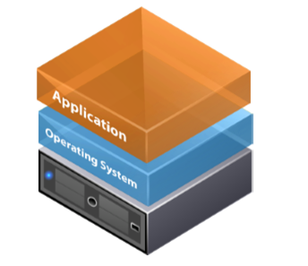
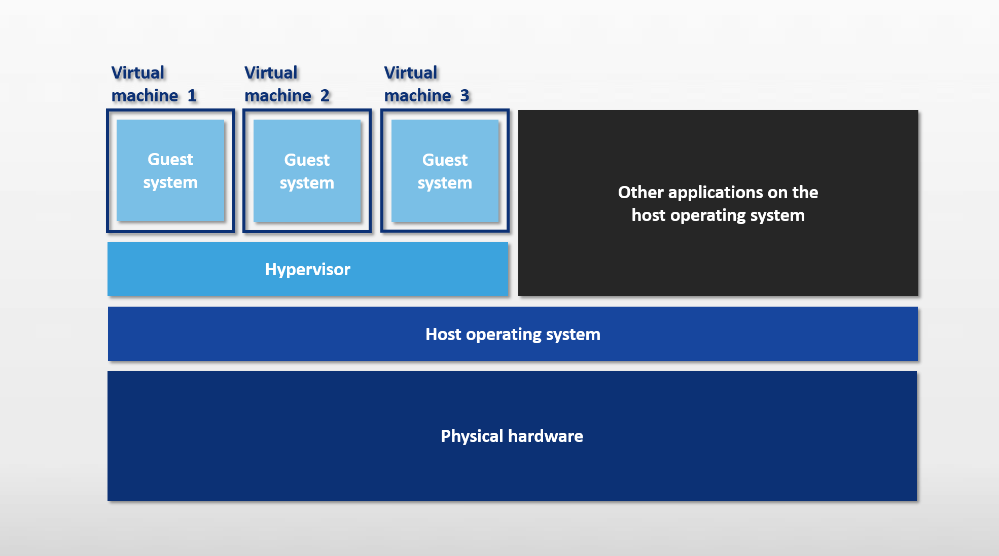
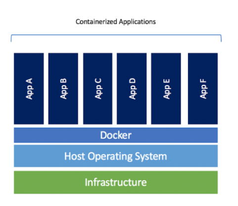
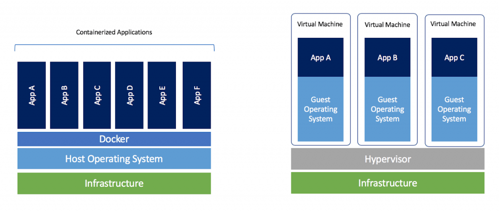
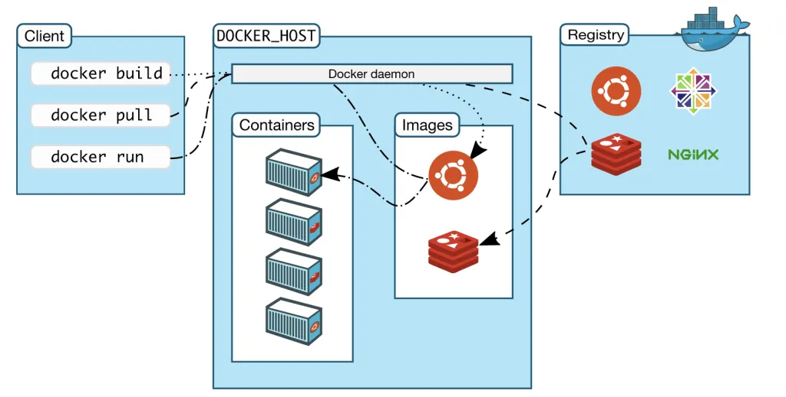
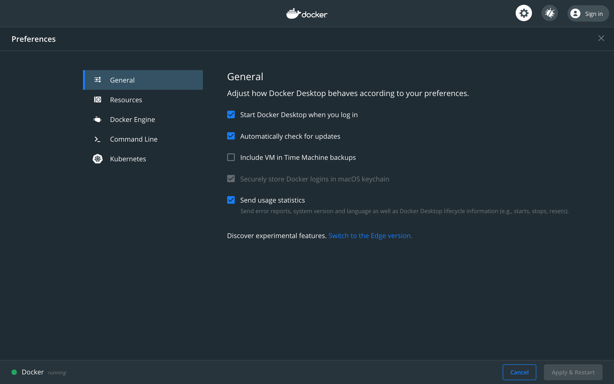
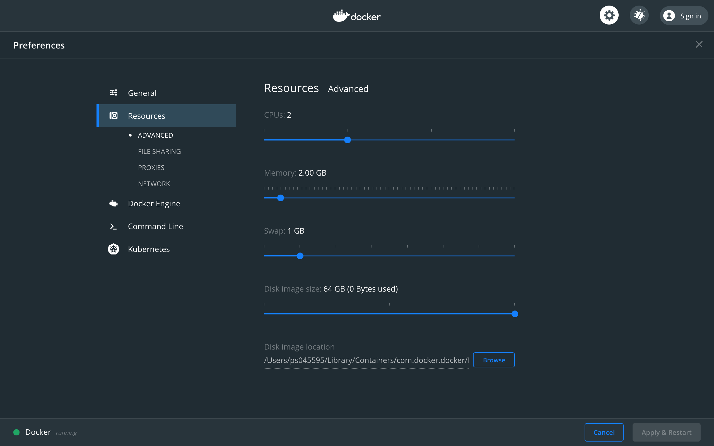

# Containers and Dockers

> Container: A standardized unit of Software

## Let's understand our Problem

You're developing an website, and its time to deliver it. Consider you've designed your application to register users into to a wedding party, the validity of your application is until your wedding day and after that you don't need it anymore. But when hosting it you're hosting it on a server with the following configuration:
* 64 GB of RAM
* 32 core processing
* 1TB of HDD

But does that mean you're using all your resources efficiently? The answer is No!

The problem of computing resource utilization is old and the advancement in it have given us what we'll be learning today, Docker.

Lets understand our Infrastructure:
### Physical Server



If we had to host another application or scale the same application we'd go ahead and add more servers to it, this would result in over allocation, cost, under-utilization of resources when systems not in use, challenges in getting the configuration right and monotonus use of the resource. 

To save the day VMware introduced us with something called as Virtualization and it was a game changer.

### Virtaul Machine



With the introuduction of Virtaulazation, you could run multiple guest OS on a same physical host server and deploy your apps on these VM's which were isolated from each other. Adding more efficiency,usage of resources vs. physical servers, reducing over-allocation of actual physical resources, ease of scaling by adding more vm's to hosts. 

But, Virtualization is expensive in terms of how your resouces are getting used, you needed to invest in multiple kernels, multiple OS's to run on the Host OS and you need to configure them to best suit the applications which if not done right would end up in either overwhelming your resources or under-utilizing your resources.

Fast-Forward >> Modern day containerization, where you package your code along with its dependencies and packages into one unit called containers images and then deploy them using Docker.

## Docker



Docker is a tool that allows you to run containers on a host machine

* **Lightweight**: you don't need to spin virtaul machines, the Docker images are an app baked with its dependencies and packges that can run independently using the docker engine
* **Portable**: The same docker image can be run on a windows system or a linux system as it uses the Docker(a Docker Config file) to spin it up and it does not have any system dependencies
* **Fast**: Unlike traditional systems, where the system would first boot, load packages and then start you app, Docker containers start is a jiffy
* **No Hypervisor**: Dockers do not need a seperate kernel running for each application but rather will use the same kernel as that of the host system

What does Docker solve?
1. "It works on my computer, but not theirs": as we package the whole application along with its dependencies inside an image and then its the same image that gets deployed to various environments
2. Easier dependency management: as we bake all our dependencies in a docker image, there is no clutter of dependencies around the system
3. Lightweight: We end up using our resources to best of its capabilites
4. Scaling: Its easy to spin up more containers than set-up more virtual machines and deploy the apps on them
5. Secure: Containers apply aggressive constraints and isolations to processes without any configuration required on the part of the user.

Pictorial Differenc:



To Sum it up - [Container Explainer](https://www.youtube.com/watch?v=FWpnbGnzk08)

### How Docker works internally?


Components:
* Server: It is the docker daemon called dockerd. It can create and manage docker images. Containers, networks, etc.
* Rest API: It is used to instruct docker daemon what to do.
* Docker Command Line Interface (CLI): It is a client which is used to enter docker commands.

### Docker Architecture



* Docker Client: Docker users can interact with Docker through a client. When any docker commands runs, the client sends them to dockerd daemon, which carries them out
* Docker API: is used by Docker commands. Docker client can communicate with more than one daemon.
* Docker Registeries:It is the location where the Docker images are stored. It can be a public docker registry or a private docker registry. Example: Docker Hub or Jfrog artifactory
* Docker Objects: Images, containers, volumes and networks are all docker objects
* Images: Images are read-only template with instructions to create docker containers. We can pull an image from Docker hub and use it as is or we can add more functionalities to existing image and create a new one. A image of our own can be created using a Dockerfile
* Containers: an Container is an image in run-time, using CLI we can start, stop, delete a container
* Volumes: adding additional and persistent volume to store data outside a container can be achieved by attaching a volume to a container

Example:
```
docker run -d --name geekflare  -v geekvolume:/app nginx:latest
```
* Network: Docker networking is a passage through which all isolated containers communicate
There are 5 types of networks:
    * Bridge: a default network driver for container, this type of network is used when multiple containers are communicating with the same docker host
    * Host: This driver removes the isolation between the container and the host, this is used when we do not need any network isolation between host and contaner
    * Overlay: this network type is used when the containers are running on different docker hosts and enable swarm services to communicate
    * None: This driver disable all network
    * macvlan: this driver assigns the mac addresses to containers to make them look like physial machines, the traffic is routed between containers through their mac addresses


[Read more](https://geekflare.com/docker-architecture/)

## The Real Deal

Let's get our hands dirty by doing some containerization and docking them with Docker!
1. Docker installation:
    * Docker installation for Mac - https://docs.docker.com/docker-for-mac/install/
    * Docker installation for Windows - https://docs.docker.com/docker-for-windows/install/


Make sure your docker daemon is running. 

#### Test your docker versions:
```
docker --version
Docker version 19.03.8, build afacb8b
```

#### Lets try out running something in Docker as a container:

Run 
`docker image ls`

And now run your first docker container
```
docker run hello-world

Hello from Docker!
This message shows that your installation appears to be working correctly.

To generate this message, Docker took the following steps:
 1. The Docker client contacted the Docker daemon.
 2. The Docker daemon pulled the "hello-world" image from the Docker Hub.
    (amd64)
 3. The Docker daemon created a new container from that image which runs the
    executable that produces the output you are currently reading.
 4. The Docker daemon streamed that output to the Docker client, which sent it
    to your terminal.

To try something more ambitious, you can run an Ubuntu container with:
 $ docker run -it ubuntu bash

Share images, automate workflows, and more with a free Docker ID:
 https://cloud.docker.com/

For more examples and ideas, visit:
 https://docs.docker.com/engine/userguide/
```
Lets verify the images now:
`docker image ls`

### Lets spin up ubuntu
```
 docker run -it ubuntu
```

When you execute this command, you get into the console of your new ubuntu container, this image if not already pulled from docker hub will be first fetched and then executed

### Understanding a Dockerfile

Dockerimages use their soure code from the Dockerfile specifed in the same directory. Dockerfile is a  configuration file that has certain commands with dedicated functionality

Dockerfile structure:
```
FROM <base_image>
RUN <set of command related to the base_image>
CMD <command to run>
ADD <file/URL to copy>
ENTRYPOINT <environment>
```

**Dockerfile Commands**
 * FROM - specifies the base(parent) image. Alpine version is the minimal docker image based on Alpine Linux which is only 5mb in size.
 * RUN - runs a Linux command. Used to install packages into container, create folders, etc
 * ENV - sets environment variable. We can have multiple variables in a single dockerfile.
 * COPY - copies files and directories to the container.
 * EXPOSE - expose ports
 * ENTRYPOINT - provides command and arguments for an executing container.
 * CMD - provides a command and arguments for an executing container. There can be only one CMD.
 * VOLUME - create a directory mount point to access and store persistent data.
 * WORKDIR - sets the working directory for the instructions that follow.
 * LABEL - provides metada like maintainer.
 * ADD - Copies files and directories to the container. Can unpack compressed files.
 * ARG - Define build-time variable.

Read more
[reference1](https://dzone.com/articles/understanding-dockerfile)
[reference2](https://blog.hipolabs.com/understanding-docker-without-losing-your-shit-cf2b30307c63)

### Lets move beyond hello-world, how about some programming?

Lets write a small program in python, bcoz why not?
Lets create the first 20 Fibonacii numbers:
Steps to follow:
1. Create a folder of your choice and move to that folder:
```
mkdir docker_by_example
```

2. Create a python program by name of your choice, example: `fibonacii.py` and paste the follwing code in that file:
```
# Program to display the Fibonacci sequence up to n-th term

nterms = 20

# first two terms
n1, n2 = 0, 1
count = 0

# check if the number of terms is valid
if nterms <= 0:
   print("Please enter a positive integer")
elif nterms == 1:
   print("Fibonacci sequence upto",nterms,":")
   print(n1)
else:
   print("Fibonacci sequence:")
   while count < nterms:
       print(n1)
       nth = n1 + n2
       # update values
       n1 = n2
       n2 = nth
       count += 1
```

3. Lets build something called as a Dockerfile (config as code):
create a filename called as `Dockerfile` and paste the following content in that file:
```
FROM ubuntu
MAINTAINER Sam
RUN apt-get update
RUN apt-get install -y python
ADD script.py /home/script.py
ADD fibonacii.py /home/fibonacii.py
CMD ["/home/script.py"]
ENTRYPOINT ["python"]
```
The very first line will be our decalaration of our base image, the **RUN** keyword is used to execute a command and ADD is used to copy file from your current directory to the directory specifed on the container, if an command is passed with CMD it will be the first command to be executed as soon as the container is initialised, this can be overriden by running our own commands while running the docker container using `docker run`. The ENTRYPOINT helps to create an exectable container and the command and arguments provided with it cannot be overriden.

4. Let move ahead with building the container
Execute the following command from your current directory where you have your dockerfile
```
docker build -t pythonimage . 
```

5. Lets fire up the container
```
docker run --name test1 pythonimage
```
And as said we can override the command specified with CMD using the follwing run:
```
docker run --name test2 pythonimage /home/fibonacii.py 
```

### The previous result can be achieved using much optimized steps in Dockerfile, thanks for images

So you new Dockerfile looks something like:
```
FROM python:3
ADD fibonacii.py /
CMD [ "python","./fibonacii.py" ]
```
Again the following steps:
Build: `docker build -t python_image . `
Run: `docker run --name fibo python_image`
and viola! 
```
Fibonacci sequence:
0
1
1
2
3
5
8
13
21
34
55
89
144
233
377
610
987
1597
2584
4181
```

### Do we need to stop here? Nope, lets spin up a Static WebPage real quick

1. Either clone this or download this repo to your system - https://github.com/PrathameshSam/docker_web_demo
```
git clone https://github.com/PrathameshSam/docker_web_demo
```

2. Navigate to the helio directory and check the docker file `cd docker_web_demo/helio`
```
FROM nginx:alpine
COPY . /usr/share/nginx/html
```
What are you doing here?
While you use nginx's alpine as a base image, you're copying the whole directory of your code to `/usr/share/nginx/html` on the container. That's all, that is your dockerfile.

3. Lets build this image:
```
docker build -t helio-app .
```

4. What differs in a web app from a normal script, we need to specify a port on which the app will be listening to:
```
docker run -d -p 80:80 helio-app:latest 
```
some flags: -d (detach): is used to run the container in the background and to print the container id.
-p (publish): Publishes a container's port(s) to the host

Navigate to your localhost in browser and experience the webapp!

_Feel like a developer yet?_

Let's move to some operations:
Important Docker commands: **General**

* To see all the images that you've pulled or created: `docker images`
* List of all container running: `docker ps`, use `docker ps -a` to list all running/stopped/exited containers
* To execute a bash command on any of your running container: `docker exec <container_id> <command>`
* stopping a container: `docker stop <container_id/name>`
* starting a container: `docker start <container name>`
* Removing a container: `dcoker rm <container name>`
* Removing an image: `docker rmi <imageid>`
```docker rmi 055936d39205                                                                            
Untagged: alpine:latest
Untagged: alpine@sha256:769fddc7cc2f0a1c35abb2f91432e8beecf83916c421420e6a6da9f8975464b6
Deleted: sha256:055936d3920576da37aa9bc460d70c5f212028bda1c08c0879aedf03d7a66ea1
Deleted: sha256:f1b5933fe4b5f49bbe8258745cf396afe07e625bdab3168e364daf7c956b6b81
```
* Docker image size(shows size of your running containers): `docker container ls -s`
* Images size(output of): `docker images`
* Inspect all attributes related to docker container: `docker inspect <container name>`

**Network Related**
* create a network: `docker network create <network-name>`
* Attaching a network to a container: `docker network connect <network_id> <container_id>`
* Attaching a container during the inital run:
```
docker create --name my-nginx \
  --network my-net \
  --publish 8080:80 \
  nginx:latest
```
Listing the available networks:
```
docker network ls
NETWORK ID          NAME                DRIVER              SCOPE
319790f6081a        bridge              bridge              local
c8db02bf92ea        host                host                local
aa97883f8263        none                null                local
```
* Disconnecting the network from you container: ` docker network disconnect <networkid> <containeid>`
* Removing you network: `docker network rm <containerID>`

**Volume Related**
* Creating a volume: `docker volume create <volumename>`
* Creating a volume with desired size and type: `docker volume create --opt type=aufs --opt o=size=10G,uid=501 --opt device=/var/lib/docker/aufs myvolume`
* Listing volumes:
```
docker volume ls                                                    1 ↵  10481  07:51:12 
DRIVER              VOLUME NAME
local               3be9aefff018a10245f8d6fdbbe86036d01fbc55b30e83e9bc81400b4a9bd1ab
local               040ada438e74996f1303d4de19c9c129d3a9413cd85fa24ecccb08ccac851606
local               jenkins-data
local               my-vol1
local               myvol
local               myvolume
```
* Inspect the volume:
```
docker volume inspect myvolume
[
    {
        "CreatedAt": "2020-06-26T02:18:40Z",
        "Driver": "local",
        "Labels": {},
        "Mountpoint": "/var/lib/docker/volumes/myvolume/_data",
        "Name": "myvolume",
        "Options": {
            "device": "/var/lib/docker/aufs",
            "o": "size=10G,uid=501",
            "type": "aufs"
        },
        "Scope": "local"
    }
]
```
> Note: To attach a volume into a running container, 
> * use nsenter to mount the whole filesystem containing this volume on a temporary mountpoint;
> * create a bind mount from the specific directory that we want to use as the volume, to the right location of this volume;
> * umount the temporary mountpoint.

### A little more about Docker

Docker engine config on your system
```
Client: Docker Engine - Community
 Version:           19.03.8
 API version:       1.40
 Go version:        go1.12.17
 Git commit:        afacb8b
 Built:             Wed Mar 11 01:21:11 2020
 OS/Arch:           darwin/amd64
 Experimental:      false

Server: Docker Engine - Community
 Engine:
  Version:          19.03.8
  API version:      1.40 (minimum version 1.12)
  Go version:       go1.12.17
  Git commit:       afacb8b
  Built:            Wed Mar 11 01:29:16 2020
  OS/Arch:          linux/amd64
  Experimental:     true
 containerd:
  Version:          v1.2.13
  GitCommit:        7ad184331fa3e55e52b890ea95e65ba581ae3429
 runc:
  Version:          1.0.0-rc10
  GitCommit:        dc9208a3303feef5b3839f4323d9beb36df0a9dd
 docker-init:
  Version:          0.18.0
  GitCommit:        fec3683
  ```
  Managing how your docker engine starts on your machine and configuring the docker engine: GUI
  
  **Managing the start-up**
  
  
  **Managing Resources of Docker engine**
  

### Publishing your images

* create a docker hub account: https://hub.docker.com/ and sign-up
* once created, login from your cli into docker hub
```
docker login
Login with your Docker ID to push and pull images from Docker Hub. If you don't have a Docker ID, head over to https://hub.docker.com to create one.
Username: prathamesh13
Password:
Login Succeeded
```

* Once logged in, lets tag our image:
```
docker tag helio-app  prathamesh13/helio-app:v1   
```
* Lets push our image
```
docker push prathamesh13/helio-app:v1
The push refers to repository [docker.io/prathamesh13/helio-app]
2ce5ff94d693: Pushed 
1d98ebade1db: Mounted from library/nginx 
531743b7098c: Mounted from library/nginx 
v1: digest: sha256:5378561008c2134386a025b86552975786b1970ef7a25520ddb5bda9877a6638 size: 950
```
* Lets pull the image directly from dockerhub and run it
```
docker run -d -p 80:80 prathamesh13/helio-app:v1
65700d6034266c6f9b538f55a160c38a99b58743bdd91ee6a7827e13133d2d00
```


More commands at - 
https://docs.docker.com/engine/reference/run/
https://geekflare.com/docker-commands/