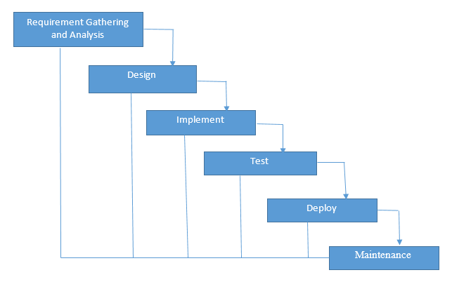
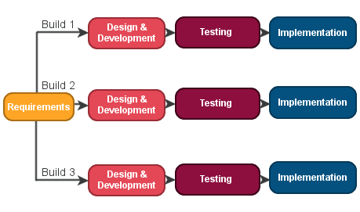
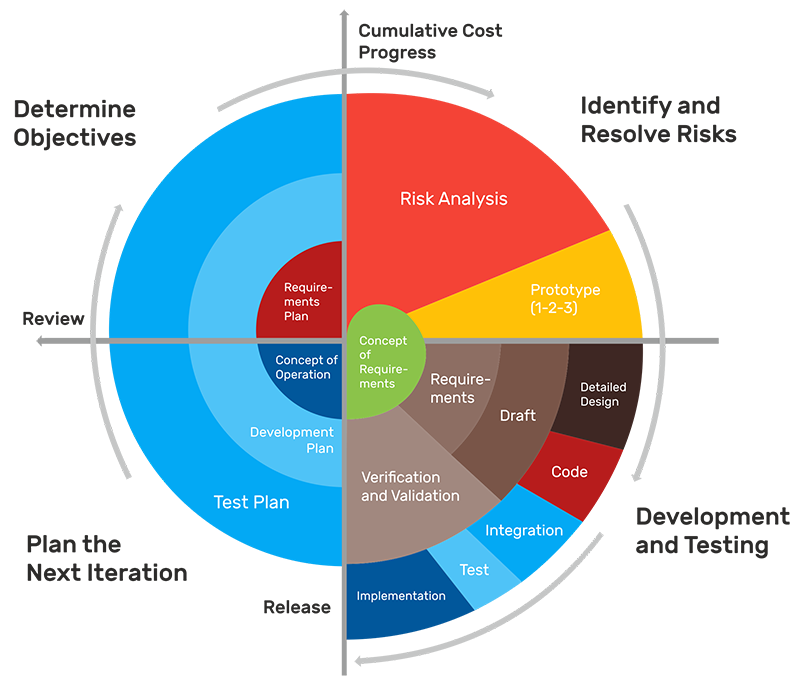
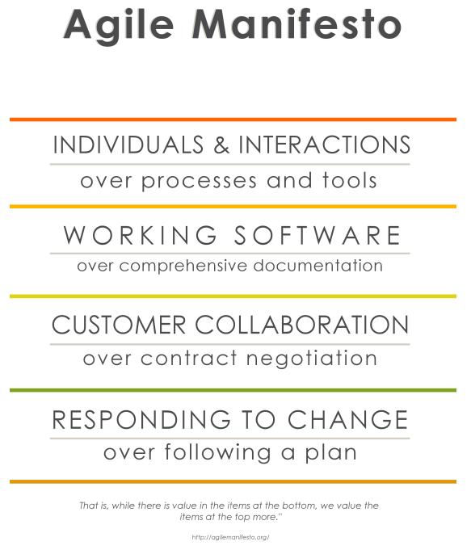
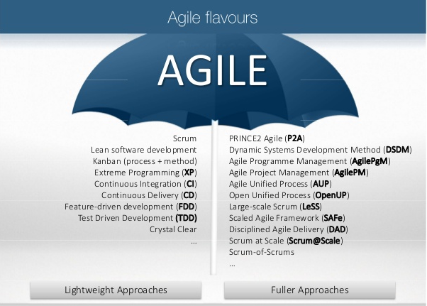
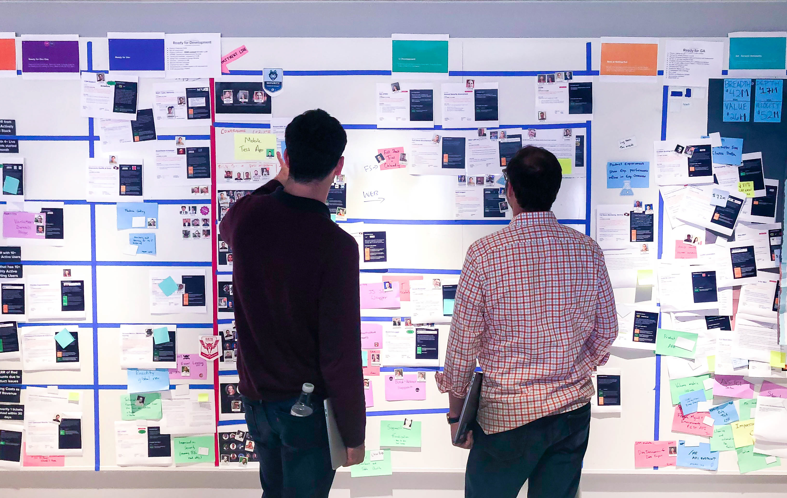

# Agile Software Development

The industry has seen revolutions and innovations very frequently, it has been adapting new technologies, new tools, new ways to implement solutions(traditional build everything, to use API's). Let's speak about one such adaptation of process which defined the way how we delivery our modern Software/IT soultions to the world. But before that, lets understand the problem:

## Software Development LifeCycle

We all know the steps of SDLC and have imlplemented them in our projects, the standard steps are common for any methodology the only difference among them is how these steps are implmeneted, the flexibility around the development lifecycle, the ease of adapting changes, collaboration and the customer involvement is what differs.
Standard Steps:
* Requirement gathering, elecitation and planning
* Requirment Analysis
* Design
* Implementation
* Testing and Integration
* Delivery and Maintenance

### Waterfall model:

The linear and sequential implementation of Software development, where each phase/steps from SDLC have to be completed before moving to next step where these steps did not overlap on each other.
Problems:
    * Challenging to address new changes during the later phases of development
    * Customer interaction was least
    * Integrations is harder to implement when working with a bigger team on a bigger project
    * Collaboration of teams was a hard task to achieve
    * The working software was delivered at the delivery phases, which then would be evaluated whether or not it met the customer requirements(time to market is more)
    * Changes are hard to implement

Other models where the working software was delivered at the later stages include **Iterative/Incremental model, Spiral Model**

Image Illustration to these models:
 
 **Waterfall model**

 

**Iterative model**

**Spiral Model**

The problem with all the models mentioned above was their flexibility to adapt change and the delivery of the software for the customer to use(which was at the very later part) and the limitiations on getting feedback from the customers at early stages.

The failure of system as a whole was also a problem in the above model, you'd never predict in early stages whether or not the system as a whole would work as intended when deployed until it was actually integrated and deployed

## Agile

> Fails fast, Fail early, fail often, fail cheap!

The fail-fast, fail-early or fail-often is a well known philosophy that has been used along side Agile, Agile if to define is a group of software development methodologies based on iterative development, where requirements and solutions to those requirements constantly evolve through collaboration between self-organizing cross functional teams and where the customer is part of the whole process.

Agile development refers to any development process that is aligned with Agile manifesto and agile principles.

> Lean and Agile are not the same: 
Lean is a process of eleminating waster and inefficient processes to improve and outcome
Agile is set of methodologies and principles that define how SDLC should involve collabortation, feeback, faster delivery etc(coined in Manifesto and Principles). [Read more](https://www.forbes.com/sites/danpontefract/2018/09/15/the-foolishness-of-fail-fast-fail-often/#6a22d00259d9)

### Agile Manifesto

The [Agile Manifesto](http://agilemanifesto.org/), set out 4 important values. 

### Agile Principles

The [Agile Principles](http://agilemanifesto.org/principles.html), provide guidance and more detailed detailed explaination in addition to Agile Manifesto

1. Our highest priority is to satisfy the customer through early and continuous delivery of valuable software.
2. Welcome changing requirements, even late in development. Agile processes harness change for the customer’s competitive advantage.
3. Deliver working software frequently, from a couple of weeks to a couple of months, with a preference to the shorter timescale.
4. Business people and developers must work together daily throughout the project.
5. Build projects around motivated individuals. Give them the environment and support they need, and trust them to get the job done.
6. The most efficient and effective method of conveying information to and within a development team is face-to-face conversation.
7. Working software is the primary measure of progress.
8. Agile processes promote sustainable development.
9. The sponsors, developers, and users should be able to maintain a constant pace indefinitely.
10. Continuous attention to technical excellence and good design enhances agility.
11. Simplicity–the art of maximizing the amount of work not done–is essential.
12. The best architectures, requirements, and designs emerge from self-organizing teams. At regular intervals, the team reflects on how to become more effective, then tunes and adjusts its behavior accordingly.

## Agile Methods

There are several method under the agile umbrella, 

Two most famous Agile methods that are widely followed in the Software Industry are:
1. **Scrum**

Scrum is a framework, for effective team collaboration and can address complex problems while productively and creatively delivering products of highest possible value.

2. **Kanban**

Kanban is another popular framework used in agile software development. How it is different from scrum is the work items are visually represented on an Kanban board, allowing team memebers to see the state of every piece of work. Kanban can be either a physical board or a digital board

Tools like Jira, Trello are helpful in creating Kanban boards digitally